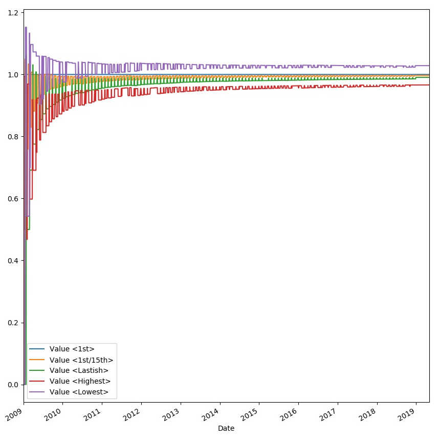

# Backtesting

Convincing myself of investment basics.

For fun.

Please draw your own conclusions, do _not_ take this as financial advice.

# backtest-day-to-invest.py

Assuming I receive x salary and want to automatically invest it
monthly, how should I pick which day of the month to invest it on?

## Conventional wisdom

Asap. "Time in market beats time to market" - any signal would be arb'ed away.

## Hypothesis

The limited recurring investment timing options offered by major vendors lead
to major buy orders on specific dates, raising the price on these dates. This
effect is larger than any possible arbitrage. "Monday effect" etc.

## Method

Plot total portfolio size over time for different strategies that invest a
fixed amount per month distributed over different days that month, normalized
against a baseline strategy of investing the full amount on the 1st each month:

1. Invest full amount on 1st each month (or next business day)
2. Invest half/half on 1st/15th each month
3. Invest around last day each month
4. Invest on day with highest stock price (theoretical!)
5. Invest on day with lowest stock price (theoretical!)

## Observation

* The curves end up parallel and spaced such that most or all of their difference
  is within around 1 month difference in investment duration.

## Conclusions

Please draw your own conclusions. Mine are:

* Dumb "asap" investment is reasonable. Long term gains are purely based on time in market.

* The dumb "asap" strategy is ~4% better than the (impossible) "worst day" strategy
  and ~4% worse than the (also impossible) "optimal day" strategy on large timescales
  (this advantage does _not_ compound). Meaning it's not even really worth thinking
  about, and gains are dominated by long term market movement, not "clever" investment.

Obvious, maybe, but it's nice to see it confirmed by data.

## Caveats: Backtesting is hard...

* This 10-year backtest happens to neatly align to just after the last big
  recession.

* I assumed mutual funds, meaning daily granularity is fine as the adjusted
  closing price each day can be used. With ETF's it's much harder to backtest.
  This is ok - ETF's don't allow auto-investing, and the goal of this experiment
  was to see how one would set up long term auto investing.
  Also ETF's tend to track their corresponding mutual funds very closely.
  It may make sense to convert the accumulated mutual fund shares to ETF share
  every once in a while for the slightly lower expense ratio. This only makes
  a difference for very large amounts of money, ie does not apply to me ;-)
  For new investments the time-in-market benefit of auto-investing would easily
  outweight the delta in expense ratio.

* Slightly different (<1mo) total investment length is not accounted for correctly.
  I know no correct way to do that (if you're just starting out and today is the
  2nd of a month, and your strategy was to invest on the first, would you invest
  all today or wait for the 1st so it fits your strategy?)

* This is only one relatively large, broad-market stock fund. (Investing in broad
  market funds is in line with Bogleheads philosophy that active / targeted investing
  will not beat passive / broad market investing over long time periods.)

* I'm assuming equal investments each month; ie no strategy can delay more than
  30 days (or so).

* The "optimal" strategy does perform slightly better than the naive strategies.
  All we can easily see from this experiment is that any "simple" (e.g. what a
  typical broker's web interface would offer) strategies perform roughly the
  same. Again the aim was to investigate auto investing options.

* Any unknown unknowns

